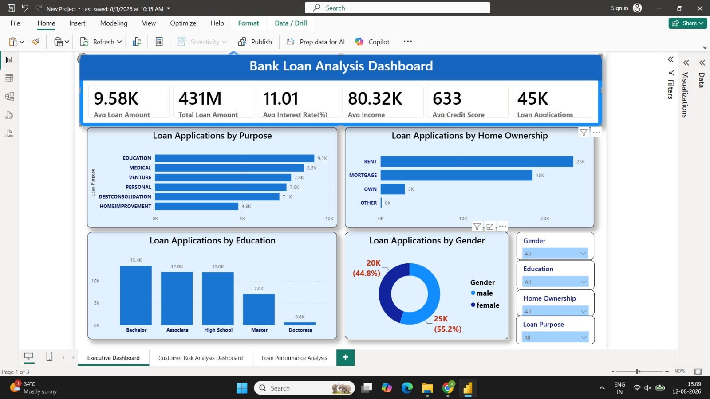
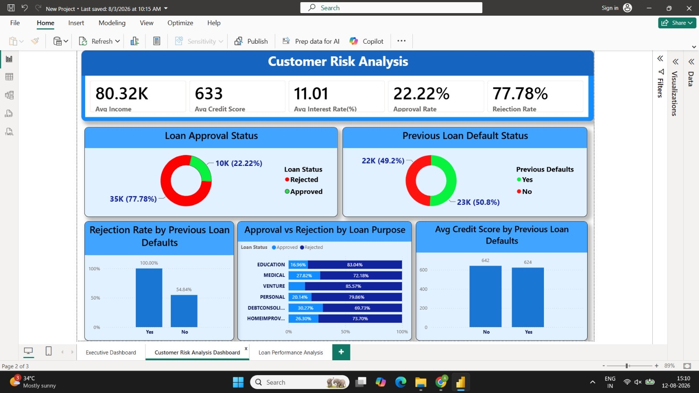
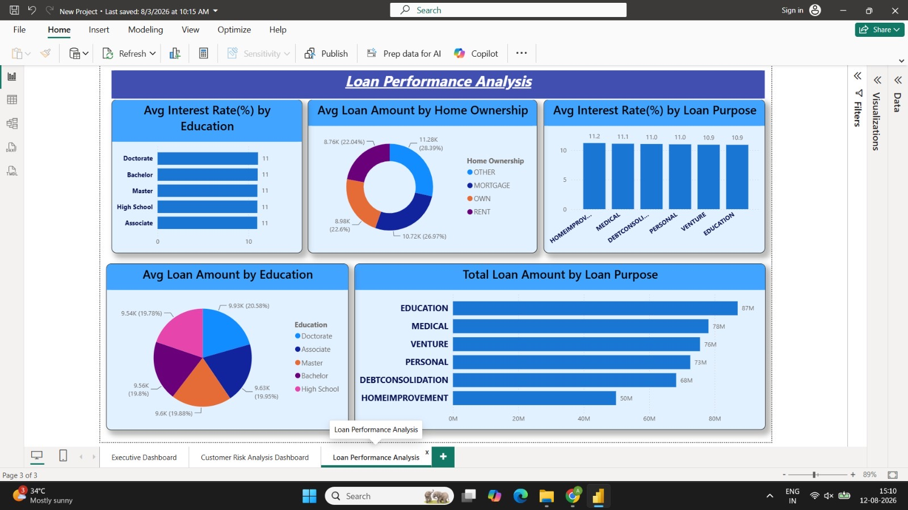

# 📊 Bank Loan Analysis Dashboard | Power BI

An interactive **Power BI dashboard** designed to analyze bank loan applications, approval and rejection trends, customer profiles, and credit risk patterns.

This project demonstrates my practical skills in **Power BI, data analysis, dashboard design, data visualization, and business intelligence**.

---

## 📌 Project Overview

The Bank Loan Analysis Dashboard provides a comprehensive view of loan application data and helps identify important patterns related to:

- Loan approvals and rejections

- Customer demographics

- Loan purposes

- Education background

- Home ownership

- Gender distribution

- Previous defaults

- Income levels

- Credit scores

- Interest rates

- Credit risk patterns

The dashboard is designed to transform raw loan data into meaningful business insights through interactive visualizations and KPIs.

---

## 🎯 Objectives

The main objectives of this project are to:

- Analyze overall loan application performance

- Compare approved and rejected applications

- Calculate approval and rejection rates

- Understand customer profiles

- Analyze loan applications by purpose

- Identify credit risk patterns

- Study the relationship between income and credit score

- Analyze previous loan defaults

- Present insights through an interactive Power BI dashboard

---

## 📊 Dashboard KPIs

The dashboard includes the following key performance indicators:

| KPI | Description |

|---|---|

| Total Applications | Total number of loan applications |

| Approved | Number of approved loan applications |

| Rejected | Number of rejected loan applications |

| Approval % | Percentage of approved applications |

| Rejection % | Percentage of rejected applications |

| Average Loan | Average loan amount |

| Average Income | Average applicant income |

| Average Credit | Average credit score |

| Average Interest | Average interest rate |

---

## 📑 Dashboard Pages

### 1. Executive Dashboard

Provides a high-level overview of the complete loan portfolio.

Key areas include:

- Total loan applications

- Approval and rejection performance

- Loan applications by purpose

- Loan status distribution

- Customer education

- Home ownership

- Gender distribution

---

### 2. Risk Analysis Dashboard

Focuses on credit and loan risk indicators.

Key analysis includes:

- Average income

- Approval rate

- Rejection rate

- Credit score analysis

- Previous defaults

- Loan status

- Risk-related customer patterns

---

### 3. Customer Analysis

Provides insights into customer characteristics and their relationship with loan applications.

Analysis includes:

- Gender

- Education

- Home ownership

- Loan purpose

- Income

- Credit score

- Previous defaults

---

## 📈 Key Analysis Areas

### Loan Status Analysis

Comparison between:

- Approved applications

- Rejected applications

This helps understand the overall success rate of loan applications.

### Loan Purpose Analysis

Loan applications are analyzed based on their purpose to identify which categories contribute most to the overall application volume.

### Customer Profile Analysis

Customer characteristics such as education, gender, and home ownership are analyzed to understand applicant demographics.

### Credit Risk Analysis

Credit score, previous defaults, income, and loan status are used to identify potential credit-risk patterns.

---

## 🛠️ Tools & Technologies

- **Microsoft Power BI**

- **Power Query**

- **DAX**

- **Data Visualization**

- **Data Cleaning & Transformation**

- **Business Intelligence**

---

## 🔄 Project Workflow

```text

Raw Loan Dataset

       ↓

Data Cleaning

       ↓

Data Transformation

       ↓

Data Analysis

       ↓

DAX Measures

       ↓

Interactive Visualizations

       ↓

Power BI Dashboard

       ↓

Business Insights

💡 Skills Demonstrated

* Data cleaning
* Data transformation
* Data modeling
* DAX calculations
* KPI creation
* Interactive dashboard development
* Data visualization
* Business analysis
* Dashboard UI/UX design
* Analytical storytelling

⸻

📷 Dashboard Preview

### Executive Dashboard



### Customer Risk Analysis



### Loan Performance Analysis



⸻

🚀 Future Improvements

* Advanced DAX measures
* Detailed risk segmentation
* Drill-through analysis
* Customer segmentation
* Predictive loan-risk analysis
* Live data-source integration

⸻

👨‍💻 Author

Anupam Bindra

Aspiring Data Analyst | Power BI | Excel | SQL | Data Visualization

⸻

⭐ Project

If you find this project useful or interesting, feel free to star ⭐ the repository.

⸻

📬 Connect With Me

I am actively building my skills in Data Analytics and Business Intelligence through practical projects using Power BI and other data analytics tools

